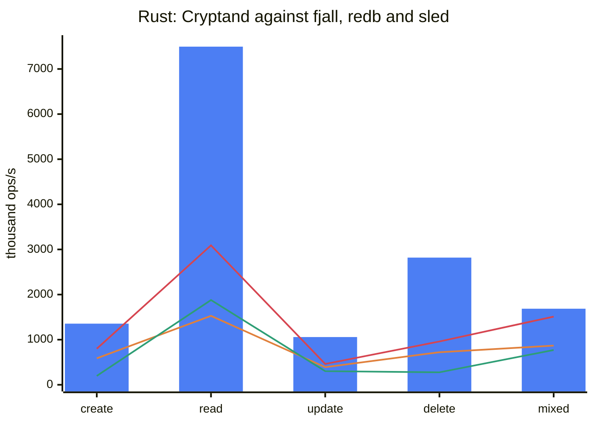
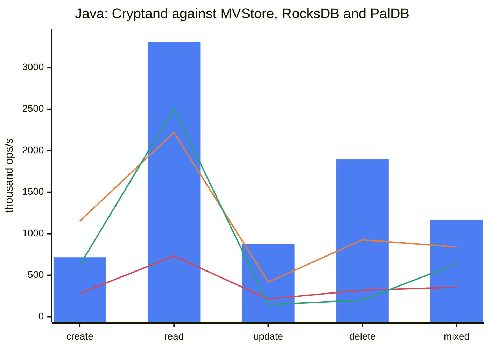
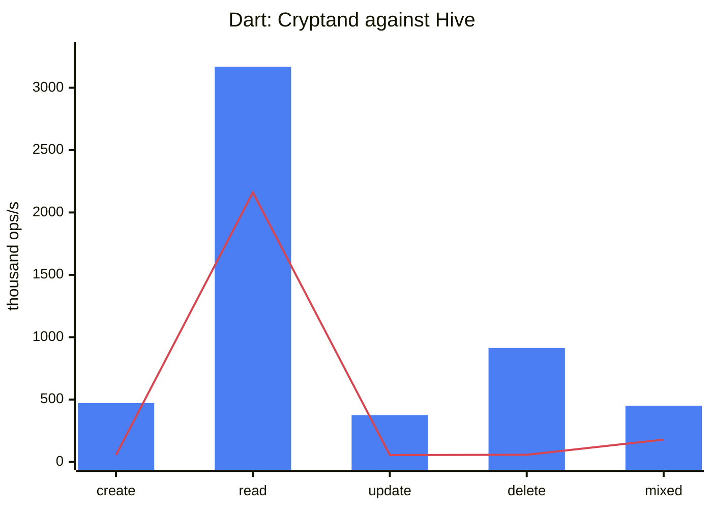
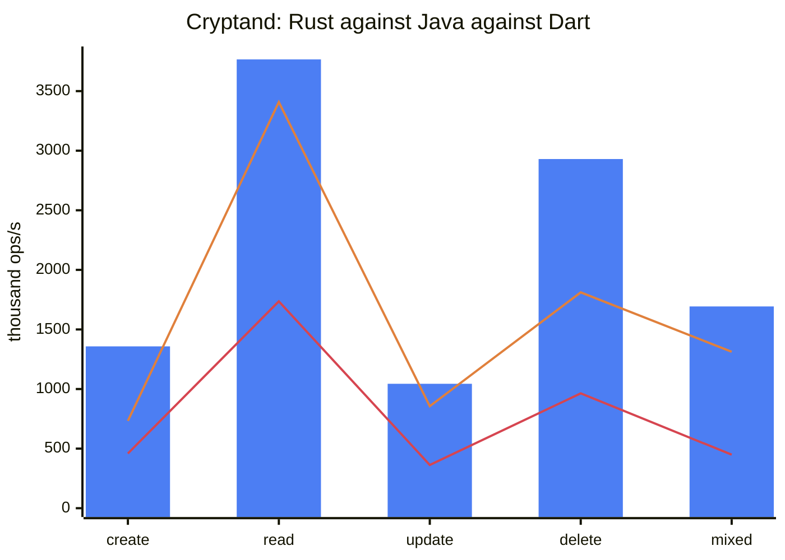

# Benchmark results

Four tables, measured on one machine (Apple Silicon, macOS/APFS, JDK 25, Dart
stable, Rust release with `lto = "fat"`), each reproducible with the script
named beside it.

Every number is a **median** of repeated runs, and every run discards a first
pass on a fresh database: a few thousand operations on a cold process measure
the process, and on the JVM they measure the interpreter — hardest for whichever
engine has the longest code path.

Measured 2026-09-11. §6 is what changed since the 2026-09-10 round, whose
numbers are kept beside these in §2. §7 is the 2026-09-12 round, on file size
and memory: the on-disk and file-bytes rows are from it, and it shows the
throughput rows did not move.

All harness code is **outside** the published artifacts: Java's benchmarks are
`test` scope, Dart's are outside `lib/` and out of the archive, Rust's are behind
a non-default `harness` feature, and each language's comparison suite is a
separate crate/package/scope so that `fjall`, `redb`, `sled`, `hive`, `paldb`,
MVStore and RocksDB appear in nobody's dependency tree but the benchmark's.

**The format did not change to produce any of these numbers.** The
cross-language interop gate (twelve rounds, both directions, encrypted
included) passes before and after: every reader computes the digest its
writer did, and verifies the file clean. Rust now lays out
the free tree differently on disk (§6.2), which the format leaves to the
writer and the gate checks from the other two sides. Everything below is an
implementation change, and the spec is untouched. See
[§5](#5-why-no-spec-change-was-needed).

---

## 1. Each implementation against its own field

`reference/bench/run_compare.sh` — 20 000 documents, one durability barrier per
phase, first pass discarded.

### 1.1 Rust: Cryptand against fjall, redb and sled

Median of 3.

| row | **cryptand** | fjall | redb | sled |
|---|---|---|---|---|
| create | **1 354 501** | 586 354 | 799 138 | 197 343 |
| read | **7 494 847** | 1 527 631 | 3 089 857 | 1 877 934 |
| update | **1 058 043** | 391 489 | 462 146 | 301 793 |
| delete | **2 819 018** | 722 387 | 960 084 | 276 470 |
| mixed | **1 685 571** | 868 387 | 1 511 007 | 770 624 |
| on disk (MB) | **27.6** | 67.1 | 33.7 | 50.9 |



*Bars are Cryptand; the three lines are, in declaration order, fjall, redb and
sled. Where the bar clears every line, Cryptand leads the row.*

Operations per second. **Cryptand leads every row against all three**, by
1.1×–10.2×; read is 2.4× redb. On 2026-09-10 redb led read and mixed; see
[§4](#4-how-the-read-row-was-won).

### 1.2 Java: Cryptand against MVStore, RocksDB and PalDB

`org.dizitart.cryptand.bench.CompareBench`, median of 3.

| row | **cryptand** | mvstore | rocksdb | paldb |
|---|---|---|---|---|
| create | 715 735 | **1 151 670** | 281 151 | 620 879 |
| read | **3 311 807** | 2 219 796 | 731 328 | 2 507 523 |
| update | **873 356** | 417 338 | 214 449 | 145 687 |
| delete | **1 896 124** | 926 312 | 320 451 | 199 570 |
| mixed | **1 170 932** | 841 277 | 354 993 | 640 066 |
| on disk (MB) | 27.6 | 33.1 | **20.3** | 10.2 |



*Bars are Cryptand; the three lines are, in declaration order, MVStore, RocksDB
and PalDB. The one line that crosses above the bar is MVStore's, on create.*

**Cryptand leads read, update, delete and mixed, and beats RocksDB on every
row** by 2.5×–5.9×; read is 1.32× PalDB and 1.49× MVStore. MVStore leads
create, because its `put` never reaches the device.

**The Java read row is the noisiest number in this file.** Its phase is 5 000
reads, about 1.5 ms, timed with two `nanoTime` calls per operation for every
engine; one run in three of the final set read 1 242 828, with a p99.9 of
10 µs where the others had 0, and no GC or safepoint in the window. The median
is what the table reports, and a single run can land below PalDB's.

**PalDB is a write-once store.** That is its design and the reason its read
column is what it is: the original LinkedIn library builds an immutable file
with a perfect-hash index and then only serves it. The `net.soundvibe` fork used
here adds `StoreRW`, a write buffer in front of that immutable file which is
compacted into a new one on `flush`, and that is the only reason an update and a
delete row exist at all. Read those two rows as *the fork's write buffer*, not
as PalDB.

**MVStore is file-backed here, not in-memory.** `MVStore.Builder().fileName(...)`
is what makes it so; without it the builder returns a store whose
`getFileStore()` is null and which never touches a disk. Its
`auto_commit_delay` is the default 1000 ms, so over a ~20 ms phase nothing is
written in the background and the whole file lands in the `store.commit()` the
benchmark times inside the create phase.

### 1.3 Dart: Cryptand against Hive

`reference/dart/cryptand-compare`, median of 3.

| row | **cryptand** | hive |
|---|---|---|
| create | **472 322** | 55 165 |
| read | **3 168 568** | 2 161 461 |
| update | **374 504** | 55 499 |
| delete | **912 909** | 57 422 |
| mixed | **450 857** | 179 330 |
| on disk (MB) | 21.2 | **10.2** |



*Bars are Cryptand, the line is Hive. The line's spike is Hive's read row --
an in-memory `HashMap` -- and it no longer clears the bar.*

**Cryptand leads every row**, by 1.47× on read and 2.5×–15.9× on the rest.

**This table calls `getView`, not `get`**, and did not until this round. Hive's
`get` returns the `Uint8List` its box holds; Cryptand's `get` copies the value
into a fresh one. `README.md`'s rule is that a read returns a handle in every
engine, and the Rust table has always called `get_ref` for the same reason, so
the Dart table was the one breaking it. Measured both ways on the same build,
median of three each: `get` 2 280 762, `getView` 3 175 611 -- the copy and
its garbage are about 28 % of a Dart point read. **With `get`, the Dart read
row is level with Hive rather than ahead of it**; the lead in the table is
the handle rule, applied as it is in the other two.

**A Hive `Box` keeps every value in memory.** `openBox` reads the whole file
into a map on open and serves every `get` from it; the file is an append-only
log that `compact()` rewrites. `LazyBox` is the variant that reads from disk and
its `get` is asynchronous, so a row for it would measure the event loop rather
than the store, and it is not here.

---

## 2. The three implementations against each other

`reference/bench/run_xlang_crud.sh` — 20 000 documents.

Median of 3.

| row | rust | java | dart |
|---|---|---|---|
| create | **1 358 265** | 733 350 | 459 443 |
| read | **3 765 534** | 3 408 219 | 1 735 509 |
| update | **1 043 723** | 855 688 | 362 950 |
| delete | **2 930 118** | 1 810 802 | 963 948 |
| mixed | **1 693 098** | 1 313 226 | 449 418 |
| persist (ms) | 0.0 | 0.2 | 11.8 |
| file bytes | 27 574 272 | 27 615 232 | 21 102 592 |
| storage model | file-backed, segments resident | file-backed | in-memory page space |



*Bars are Rust; the two lines are, in declaration order, Java and Dart. Neither
line crosses the bar.*

**Rust leads all five rows, Java is second on every row and Dart third.** That
is the intended ordering, and on 2026-09-10 Java still led update.

The Java engine has a **background committer thread**, so part of the flush an
update phase provokes lands outside the phase's own clock, while the Rust and
Dart engines pay it inline. That was the explanation offered for Java's lead on
update, and it was true, but it was not why Rust lost: Rust's update phase
spent 70 % of its time building the L0 segment the phase flushes, and the two
largest terms in that were a software CRC-32C and a per-cell allocation (§6.3).
Fixed, Rust's update is 1.22× Java's with Java keeping its thread. The same
investigation found a commit-path feedback loop that grew without bound
(§6.2); it costs the single update phase measured here almost nothing, and a
long-running database a great deal. Read `storage_model` before comparing
anything else: the three do not have the same one, and it is the largest term
in any gap between them.

This table's reads call `get` in all three -- a copy -- which is why the Rust
and Dart read rows here are below their comparison-table rows.

### Where each row started

The first column of each pair is this suite's 2026-09-10 reading.

| row | rust | java | dart |
|---|---|---|---|
| create | 962 885 → **1 358 265** | 744 121 → 733 350 | 492 380 → 459 443 |
| read | 1 776 568 → **3 765 534** | 1 587 407 → **3 408 219** | 729 501 → **1 735 509** |
| update | 777 419 → **1 043 723** | 929 987 → 855 688 | 385 238 → 362 950 |
| delete | 2 596 391 → **2 930 118** | 1 590 542 → 1 810 802 | 859 254 → 963 948 |
| mixed | 1 227 082 → **1 693 098** | 920 159 → **1 313 226** | 383 649 → **449 418** |

Every read row is 2.1×–2.4×, and Rust's create and update are 1.41× and 1.34×.
The rows that moved backwards -- Java's create and update, Dart's create and
update -- moved inside their run-to-run spread, and no change in this round
gave a Java or Dart write more to do.

---

## 3. What was actually wrong (2026-09-10)

Every entry below was found by a profile, not by reading code, and each is
followed by the instrument that found it. The three implementations turned out
to share **the same four defects**, independently written, which is itself the
finding: they are properties of the format's page layout meeting a naive
reader, not of any one language.

### 3.1 The four that all three had

| defect | rust | java | dart |
|---|---|---|---|
| **The page prefix was re-compared on every probe of every binary search.** §2.2 gives every key in a node the same leading bytes; whether they match is a property of the *node*, not of the cell, and it decides the comparison for the whole page when it fails. All three asked it once per probe — about fifteen times per point read. | 28 % of the read profile | 33 % (`ArraysSupport.mismatch`) | 4.4 % after the rest was fixed |
| **The suffix-length varint had no one-byte path.** Every cell in a page this format produces has a suffix under 128 bytes, so the length is a single byte; all three ran the general LEB128 loop with its overflow and canonicality tests. | 14 % | 22 % (`ByteReader.uvar`) | folded into the below |
| **A cell was decoded several times to answer one question.** Rust's `lookup` asked `key_len`, `key_starts_with`, `key_tail9` and `payload_offset` separately, each re-reading the cell pointer and re-decoding the length; Java built a `ByteReader` per probe; Dart built a `ByteReader` **and** a `Uint8List` view per probe, and materialised the whole internal key twice per candidate. | 4 decodes → 1 | 1 allocation per probe → 0 | 2 allocations per probe → 0 |
| **`SegmentRef::covers` allocated.** It built `successor(prefix)` — a fresh buffer — to answer a question that is `min_key.starts_with(prefix) \|\| min_key < prefix`. Called once per candidate segment per point read. | fixed | n/a (Java compares in place) | fixed |

### 3.2 Rust only

- **The read path rebuilt and re-sorted the candidate list on every `get`.**
  `candidates_for` walked every level, cloned each level's `Vec<SegmentRef>` out
  of the manifest cache, sorted it, and collected the result — `last_level() + 1`
  vector clones and sorts to answer one point read. The order does not depend on
  the key; only the `covers` test does. It is now built once per manifest epoch
  and shared through an `Arc`.
- **`range_delete_seq` walked the whole manifest on every read** to report that
  a database with no range deletes has no range deletes. The memtable already
  had a counter; the segment half now has a flag computed on the walk the
  candidate order already does.
- **`Segment::node_accesses` and `Segment::page_reads` were two relaxed atomic
  read-modify-writes per node access — about eight per point read — and nothing
  anywhere read either of them.** The counter `13-operations.md` §6 requires is
  `Pager::page_reads`, which is what every benchmark and test here uses; these
  two counted node accesses inside an already-resident extent, which
  `README.md` explicitly says is a different quantity. Deleted.
- **`Counters::segments_probed` was a `Vec<u32>` with one entry appended per
  point read and never truncated** — an engine serving a million reads a second
  grew by 4 MB/s and never gave it back, and reporting the percentile cloned and
  sorted the whole history. It is a bucket histogram now, reporting the same
  nearest-rank percentile in constant space.
- **The memtable's `BTreeMap<Vec<u8>, _>` ordered its keys through `memcmp`**,
  called through a lazy-binding stub, on keys of about twenty-seven bytes. It
  was **39.5 % of a `put`**. `compare::MemKey` gives the same order through an
  inlined eight-bytes-at-a-time comparison.
- **The point-read path allocated four times**: the CKE, the user prefix built
  from it, the internal key materialised out of the leaf, and the value copied
  out of the page. It now allocates **none** of them in the common case —
  `cke::encode_into` builds the prefix in one engine-owned scratch buffer,
  `Segment::lookup_ref` reads the cell in place, and `Engine::get_ref` returns a
  `ValueRef` borrowing the resident segment extent under its `Arc`. `malloc`
  went from 20 % of the read profile to 0.5 %.
- **`lto = "fat"` and `codegen-units = 1`.** Without them `memcmp`, `memcpy` and
  every small leaf of the segment walk are reached through a stub. Worth
  4–24 % depending on the row, and the point-read profile could not be brought
  under control without it.

### 3.3 Java only

- **`Cfh64.hash` read its eight-byte words with an eight-iteration shift loop**,
  in the hash every filter probe runs — 8.8 % of the read profile. It is one
  unaligned little-endian load through `byteArrayViewVarHandle` now, verified
  identical by the conformance corpus. This is the third time this project has
  found a byte-at-a-time word read in a hot hash; the first was Rust's CRC-32C.
- **The merge heap allocated a `Head` record per merged entry** — 20 000 per
  flush of a 20 000-document memtable, and the same again for every entry of
  every compaction. `Head` is mutable now and `next()` re-points the instance it
  just polled.
- **`BtreePage.varLen` was a shift loop**, called about eight times per cell
  across the builder's fit test and both passes of `encodeLeaves`: 7.7 % of the
  write profile. It is `numberOfLeadingZeros` arithmetic now.
- **A point read walked the memtable's skip list to prove it was empty.**
  `ConcurrentSkipListMap.ceilingEntry` still descends its index levels on an
  empty map, and after a flush every shard is empty until the next write: 8.2 %
  of the read profile.
- **A measurement defect in the harness itself.** `CompareBench` recorded
  per-operation latency into a `List<Long>`, boxing a `Long` and sometimes
  growing an array **inside the timed loop**. At the rates this table reports —
  a read is around 450 ns — that was tens of nanoseconds of harness in every
  sample, and it penalised whichever engine was fastest, which is the wrong
  direction for a benchmark to be wrong in. It is a primitive `long[]` now.

### 3.4 Dart only

- **`candidatesFor` allocated a filtered list and *sorted* it, per level, on
  every point read.** Same defect as Rust's, in a language where the sort takes
  a closure. Cached on the same validity as the level cache.
- **`hasAnyRangeDeletes` walked every level of the manifest on every read.** It
  now reads the flag computed on the walk the candidate order already does.
- **`_memtableLookup` allocated a bound and made two splay-tree descents to
  discover the memtable was empty.**

### 3.5 One thing that was measured and *not* done

The Java flush drains its memtable with one skip-list `remove` per entry, which
is `O(n log n)` and **10.6 % of the create profile**. The `ponytail:` comment at
that site named the ceiling before this round; it now names the number. Draining
by swapping in a fresh shard would be `O(1)` and is still not done, because a
writer holds no lock on that path and an entry inserted between the swap and the
re-insertion of the survivors would be lost. It is the one path in the engine
where a lost write is silent, the tests here would pass either way, and 10 % is
not worth that. The fix, if it is ever taken, is to version the memtable and
have the single write site re-publish when it observes a swap — not to remove
faster.

### 3.6 One thing that was tried and reverted

A **branchless binary search** in the Rust node — the `base`/`len` form whose
loop-carried assignment lowers to a conditional select — measured **slower**:
2.68 M reads/s against 3.0 M. The conditional select it is supposed to buy
cannot be reached, because `compare_suffix` is fallible and the `?` on every
probe is a branch the CPU has to predict anyway; the extra probe the branchless
form needs to establish its invariant is then pure cost. Both search functions
carry a comment saying so, because it is the obvious thing to try next.

---

## 4. How the read row was won

On 2026-09-10 **every remaining loss in §1 was the read row**, and every engine
that won it did so by not being an LSM:

| winner then | what its read actually is |
|---|---|
| redb (Rust) | a copy-on-write B-tree over an mmap. No memtable, no segment filters, no manifest, no candidate list, no compaction, and `get` hands back a guard over a mapped page. |
| MVStore (Java) | an in-heap B-tree. The map is resident and a read never touches a file. |
| PalDB (Java) | an immutable file with a **perfect-hash index**, mmapped. One hash and one probe, and it cannot accept a write at all without being rebuilt. |
| Hive (Dart) | an in-memory `HashMap`. `openBox` reads the whole file into it. |

That round ended by showing the gap was **compute per probe, not cache
misses** -- Rust read at 0.85× redb both at 2 000 documents, which fit in L2,
and at 20 000, which do not -- and that a point read makes about sixteen
binary-search probes, `log2(n)` plus the tree's own overhead, with 78 % of a
read in the descent. It concluded "there is no probe count to remove". Inside
the B+tree that was right.

**The probes can be removed from outside it.** A segment is immutable, so a
hash table from user key to that key's first cell -- its newest version, by §1's
inverted seq -- can be built once from the segment's own cells and can never go
stale. With it a point read is one hash, usually one slot, and one in-place
comparison against the cell the slot names: PalDB's shape, over a file that
still accepts writes. All three implementations now have one
(`Segment::lookup_ref_hashed`, `Segment.pointLookup` in Java and Dart):

- **Not part of the format.** It is built in memory from cells already on disk,
  so nothing written changes and every other reader of the file is unaffected.
  The interop gate passes on the same files as before (§5).
- **Built when it pays.** A segment builds its table once it has served one
  point lookup per 32 entries; until then, and for any segment the build finds
  corrupt, reads take the ordered seek. A segment read a handful of times, or
  the first read after opening a large database, never pays for a table it
  will not use.
- **It answers only when the first cell is the answer**: a read with no
  snapshot, or one whose snapshot is at or above that cell's seq, whose newest
  cell for the key is not a `RANGE_DELETE`. Everything else falls back to the
  seek, which is the definition. Every user key is in the table, so an empty
  slot is a definite miss.
- **The filter probe stays.** The table would answer membership exactly, but
  `filter_false_positive_rate` is defined over filter probes, and skipping them
  when a table exists would change what that metric means.
- **Cost:** 8-byte slots, two to four per distinct key (a power of two at a
  load factor between a quarter and a half) -- 16 to 32 bytes a key, 2.5-5 %
  of a segment of the suite's 640-byte documents -- and one pass over the
  cells, amortised as above.

Each implementation has a test that reads every key of a compacted segment
holding superseded versions pinned by a snapshot, tombstones, and a range
delete whose start cell is a live key's newest cell, current and at the
snapshot, and asserts the table was actually used. Each was checked by breaking
the fallback and watching it fail.

## 5. Why no spec change was needed

The brief for this round allowed the format to change if performance required
it. It did not, and that is worth recording as a result rather than an
omission:

- **Nothing found was a format problem.** Every defect in §3 is a reader or a
  writer doing more work than the bytes on disk require — re-comparing a prefix
  the page already shares, re-decoding a cell it already decoded, allocating a
  buffer to answer a question that needs none, maintaining a counter nobody
  reads. The page layout was not asking for any of it.
- **The one format change that looked promising was ruled out by measurement**,
  not by reluctance: see §4's size sweep. The point index that won the read
  row in the end (§4) is memory only and changes no byte on disk.
- **`13-operations.md` §6's metric contract is unchanged.**
  `segments_probed_per_lookup` reports the same nearest-rank percentile from a
  histogram instead of a sample list; `page_reads_per_lookup` is and always was
  `Pager::page_reads`, "pages fetched **through the pager**", which is why the
  two per-segment counters deleted in §3.2 could go — they measured a different
  quantity and no caller read them.
- **The proof is the interop gate.** Twelve rounds, four directions,
  encrypted included, on files written by each implementation and read by the
  other two: every reader agrees with its writer's digest, after this round as
  after the last. If any of this had reached the format, that gate is what
  would have said so.

---

## 6. The 2026-09-11 round

The brief: beat every comparator on read in all three languages, and make
Rust's update beat Java's. Every entry was found by a profile or a counter, as
in §3.

### 6.1 The point index, in all three

§4. On the comparison tables' read row:

| | 2026-09-10 | 2026-09-11 |
|---|---|---|
| rust | 2 128 084 | **7 494 847** |
| java | 1 633 965 | **3 311 807** |
| dart | 716 717 | **3 168 568** |

Dart's figure includes §6.5 and the handle rule of §1.3.

### 6.2 Rust: tree 1 fed itself (a defect, not a tuning)

`Engine::persist_freelist` edited the free tree one `put` or `remove` per changed
extent. Each edit copies a root-to-leaf path; each copy frees the pages it
replaced; those are new free extents, which the next commit must record, with
more path copies. Its comment called this "a bounded one-commit lag". It was a
geometric series with a ratio above one. The update row's phase run in a loop
-- compact, 5 000 updates, flush, commit (`readprof ... updphase`, with
`CFF_FREE=1` printing the list) -- showed it:

| commit | 1 | 5 | 9 | 11 | 13 |
|---|---|---|---|---|---|
| free extents | 3 | 36 | 185 | 933 | 5 205 |
| file pages | 3 789 | 4 291 | 4 746 | 7 386 | 21 750 |
| commit (ms) | 0.1 | 1.3 | 16.7 | 92.8 | 606.5 |

`Pager::alloc_extent`, a linear best-fit scan over that list per single-page
allocation, was 32 % of the profile by then. The edit path could also allocate
out of the very list it was recording -- the double allocation
`01-container.md` §9 classes as corruption, and which Java's committer comment
names as the reason for its own order.

It is Java's order now: release tree 1's current pages into the list at this
commit, snapshot the list, and rebuild the tree bottom-up with file-extending
allocations only (`CowTree::rebuild_fresh`); a commit whose list and root are
unchanged writes nothing. Over the same loop the list holds 3-19 extents and a
commit takes 0.04 ms. The allocator's scan is also bounded now: the list is
keyed by `(commit_id, start_page)`, so the reclaimable extents are a prefix of
it, and an exact fit ends the search with the same choice a full scan makes.

The residue, marked `ponytail:` at the site: tree 1's released pages are
single-page extents only the other copy-on-write trees reuse, so a commit that
changes the list can grow the file by tree 1's size, typically one page. Java
has the same ceiling.

### 6.3 Rust: the update row

With commit fixed, an update phase was 1.46 ms of `put`, 4.8 ms of flush and
0.5 ms of commit; the flush is the L0 segment the phase's writes become.

- **The page CRC-32C was 28 % of segment building.** The last round made it a
  slicing-by-8 table and its comment rejected `std::arch` as "the same order of
  magnitude". It is `crc32cx` on ARMv8 with `FEAT_CRC32` and `crc32q` on
  x86-64 with SSE4.2 now, runtime-detected, with the table as the fallback and
  a test that the two agree on every length and alignment. Flush 4.8 → 3.0 ms.
- **`encode_node_page` built every cell in its own `Vec`** and then copied it
  into the page -- an allocation and a second copy per cell of every page
  every flush and compaction emits. Cells are written in place. Flush
  3.0 → 2.6 ms.

Update 726 837 → 1 058 043 and create 954 138 → 1 354 501 on the comparison
table; on the cross-language table Rust's update is 1.22× Java's.

### 6.4 Java

Beyond §4, one read-path cost was worth taking: choosing the memtable shard
hashes the key -- **12 % of a read** once the segment side was a hash probe --
to find a shard that is empty after every flush. `residentEntries` is counted
after an entry is in its shard and before its batch is published, so zero
proves there is no published entry to find, and a reader that requires
publication now skips the shard. The seek key is built only when something
seeks.

The Java read row is still the noisiest here (§1.2). Chasing it: no GC or
safepoint lands in the window, the engine's two background threads are idle,
and the page cache takes no misses. Across repeated passes in one process the
steady state is 4-5.5 M reads/s; the measured pass lands at 2.6-3.4 M, with an
occasional run far lower.

### 6.5 Dart

After §4 took the descent (60 % of a read), the rest of a Dart read was
allocation and polymorphic element access, which the JIT does not see through:

- `candidatesFor` built a list per read. The candidate order is walked in
  place, counting `filterAdmitted` exactly as the list did.
- `SegmentRef.covers` compared through `compareKeys(List<int>, List<int>)`,
  which every caller in the library reaches with every kind of byte list, so
  each element read was a polymorphic call: **10.7 %** of a read, for two
  comparisons of thirteen bytes. It has its own typed loop, in one pass;
  `compareKeys` and `cfh64` take a `Uint8List` fast path.
- A segment's parsed nodes were a `Map<int, Node>`; they are a list indexed by
  page.
- Building a record went through a `ByteReader`, whose `ByteData` view is an
  allocation, after two separate passes to test the key.
  `Node.recordIfVersionOf` does it in one pass with no reader, falling back to
  the general path for anything off the common encodings.
- The key was encoded into one array and copied into another to prepend the
  tree id; it is built once, in a reused writer, and `_wU64be` is one
  big-endian store rather than eight.

Steady-state `get` went 0.90 M → 2.7 M reads/s before the handle rule.

### 6.6 Measured, and not done

- **Skipping the filter probe when a segment has a point index.** Exact, and a
  cache line cheaper, but it would change what `filter_false_positive_rate`
  measures (§4).
- **Java's per-read atomic counters.** Removing all four made no difference
  outside the noise (median over twelve passes, both ways).
- **Building the index on a segment's first lookup.** Tried to remove the slow
  first stretch of each Dart read phase; it did not, because that stretch is
  the collector and the JIT settling after the compaction before it.
- **Dart's `segmentsProbed` is still an unbounded list**, one entry per read,
  as Rust's was until §3.2. The tests read it as a list; changing its shape is
  its own change. (Done in §7.4.)

---

## 7. The 2026-09-12 round: file size and memory

The brief: the same workload wrote a 31.5 MB file in Rust, 44.0 MB in Java
and 21.3 MB in Dart. Find out why, align the three on file size and on RAM,
and lose none of §1's standing.

### 7.1 What the file-size row was measuring

A page census of each implementation's final file (every page header,
`page_count`, and the reachable set from the Rust verifier, which reads all
three) settles the first question before any code is read:

| | file | `page_count` | reachable | the rest |
|---|---|---|---|---|
| rust | 31 457 280 | 3 789 | 2 542 | 1 247 free, plus 51 preallocated pages past `page_count` |
| java | 43 982 848 | 5 369 | 2 542 | 2 827 free |
| dart | 21 217 280 | 2 590 | 2 555 | 14 **leaked**, the rest free |

**The live data was already identical**: the same segments, within a page or
two of the same size, in all three. Encoding, serialization and compression
were never the variable (`page_codec` is 0 in all three, which
`01-container.md` §7's measurement is why). Every byte of the difference was
space the writer had freed and not reused, or never freed at all.

### 7.2 Why, and what changed

**Rust: `compact()` did not publish.** `01-container.md` §1 says a compaction
publishes "with one small copy-on-write path plus one superblock", and
`10-transactions.md` §5 frees the inputs "at the publishing `commit_id`". The
engine merged and freed but wrote no superblock, so the inputs stayed named by
the live one and nothing written before the caller's next commit could reuse
them: the update phase's flush appended 425 pages next to 1 679 free ones.
`compact()` now ends with a commit, at the durability the caller last asked
for. Separately, `Pager::grow` preallocates in 64-page chunks (§6 allows it)
and nothing trimmed the tail; `close()` now truncates to `page_count`.

**Java: `compact()` wrote the data three times.** `13-operations.md` §5 defines
`compact()` as "compaction to the last level". Java's pushed each level down
one step instead, so L0 was rewritten into L1, then L2, then L3, each output
allocated while its inputs were still named by the live superblock, and the
freed runs split too finely for the next level's single extent. It is now one
merge of every level above the last, as Rust's is (Dart merges each level
straight into the last, which is also one copy). Measured by
`EngineTest.compactWritesOnce`: 939 pages written for a 313-page result
before, 313 after.

**Dart: five leaks, one verifier gap, one harness mismatch.**

- `DatabaseFile.save` edited tree 1 in place. Its own path copies freed pages
  after the free list it records had been taken: the 14 leaked pages. It now
  releases, snapshots and rebuilds from fresh pages (`CowTree.rebuildFresh`),
  the order Rust and Java already commit in.
- `save` rebuilt tree 7 from nothing and never freed the copy the file held,
  so every open-and-save of a database with a value log leaked it.
- `_retire` dropped a compacted segment without freeing its file extent, so
  every segment compacted away after a reopen was a leak.
- `ValueLog.reclaimEmpty` did the same for collected value-log segments.
- Dart's own verifier walked four trees and not the catalog, tree 3, the
  attributes or tree 7, so it reported leaks on files Rust and Java call
  clean. That noise is how real leaks went unnoticed: the interop tool's
  comment blamed "a property of the format". `Database` and `DatabaseFile` now
  register those trees with the engine, and the verifier walks them.
- `bench/xlang_crud.dart` and `cryptand-compare` built a `desktop` engine
  without `vlogSegmentBytes`, so they ran 4 MiB value-log segments against
  the other two's 64 MiB. Harmless for §2's inline documents; not the same
  profile.

`file_test.dart`'s "saving leaks no page" covers all four Dart leaks, and each
fix was checked by removing it and watching the test fail.

**Rust's verifier had one false positive of its own.** Opening a file whose
writer left a value-log segment unsealed seals it (§2.1 step 8), which edits
tree 7; the orphaned page is free at the next commit but was not counted, so a
verify straight after open reported it as a leak. That is every file Dart
saves. Pending frees now count.

### 7.3 File size, after

| | before | after | `page_count` | reachable |
|---|---|---|---|---|
| rust | 31 457 280 | **27 574 272** | 3 366 | 2 542 |
| java | 43 982 848 | **27 615 232** | 3 371 | 2 542 |
| dart | 21 217 280 | **21 102 592** | 2 576 | 2 555, and 0 leaked |

§1's comparison tables move the same way: 31.5 → 27.6 MB (Rust), 44.0 → 27.6
MB (Java), 21.3 → 21.2 MB (Dart).

**Rust and Java now agree to five pages. Dart is smaller by one thing, and it
is the storage model, not a defect.** A full compaction needs its output
written while its input is still live, so a file-backed engine briefly holds
the data twice. After it, 1 680 pages are free at the front of the file; the
later phases reuse about 860 of them and the rest stay free, ready for the
next writes. Dart's segments live in the heap and are placed only at `save`,
so the intermediate copy never reaches its file. The spec's way to hand that
space back is `shrink()`, "relocate live extents downward and truncate"
(`13-operations.md` §5, a MUST). **Rust and Java both implement only the
truncate half**, so free space in front of a live extent stays in the file.
That gap is recorded here rather than closed: relocating live extents is
real I/O and its own change.

### 7.4 Memory

Measured three ways, because no single one is honest in all three runtimes:
Rust through a counting global allocator in the bench (heap above the
fixtures), Java as live heap after a full GC and as the smallest `-Xmx` that
completes, and all three as peak RSS of one engine per process on the
comparison suite, minus a process that builds the fixtures and runs nothing.

| | before | after |
|---|---|---|
| rust, heap peak inside `compact()` | 57.2 MB | 44.0 MB |
| rust, heap at the end of the run | 21.7 MB | 21.7 MB (20.8 MB of it resident segments) |
| rust, peak RSS above baseline | 84.0 MB | 70.6 MB |
| java, heap retained after `compact()` | 33.6 MB (page cache 33.4) | 13.7 MB |
| java, heap retained at the end of the run | 34.4 MB | 21.6 MB |
| java, smallest `-Xmx` that completes (fixtures alone: 40) | 88 MB | 72 MB |
| dart, resident segments at the end of the run | 20.9 MB | 20.9 MB |
| dart, `segmentsProbed` | one entry per read, unbounded | constant |

In steady state all three hold the same thing, the live segments: 20.8, 21.6
and 20.9 MB.

- **Rust's compaction held every entry twice.** `begin_compaction`
  materialised the surviving entries, and `step_compaction` *cloned* each one
  into the builder, so the job's copy lived until the job ended; every
  internal key was also cloned once more just to sort by it. Entries are moved
  now.
- **Java's page cache kept what compaction freed.** `Pager.freeExtent` never
  invalidated, although `readTreePage`'s documentation says it does, so the
  cascade's intermediate copies stayed cached until LRU pressure found them.
- **Dart's probe metric** is Rust's `SmallHistogram` now, reporting the same
  nearest-rank percentile (a test checks it against the old list).

Against the field, peak RSS above baseline: Rust Cryptand 70.6 MB against
fjall 26.9, redb 34.2 and sled 72.2; Java needs 72 MB of heap where MVStore
needs 48 and RocksDB and PalDB fit in 40 (both keep their data off the Java
heap); Dart Cryptand about 80 MB against Hive's 100.

### 7.5 Performance, before and after

The untouched `HEAD` and this change, built side by side and run interleaved,
five rounds each, medians. Every Rust and Dart row, and every Java row of the
comparison suite, is between 0.94x and 1.19x of before, and each is inside
the spread of its own baseline's five runs but one: Dart's update, 0.95x
against a spread of 3.7 %, which on a re-run ranged from 297 000 to 391 000
within a single build. The standing in §1 is unchanged: Cryptand still leads
every row against fjall, redb, sled, Hive, RocksDB and PalDB, and every row but
create against MVStore.

The Java rows of `run_xlang_crud.sh` read 0.79x to 0.94x at first, which needed
proving rather than asserting:

- **MVStore, which this change does not touch, fell 4x on delete** in the same
  JVM, straight after Cryptand. With the heap pinned (`-Xms2g -Xmx2g`) it came
  back to 1.03x.
- **Create fell as well**, and create runs before `compact()` on code both
  builds share. The discarded first pass of the old build allocated three
  compactions' worth of garbage and left G1 sized for it; the measured pass
  inherited that.
- **Under Epsilon GC (no collection at all), after four warm-up passes, create
  is 1.00x, mixed 1.00x and delete 0.99x.** Split finer, the update phase's
  puts measure 2.30 ms against 2.39 ms before and its flush 3.48 against
  3.44 ms, and the read phase 4.69 against 4.86 ms, medians over five passes
  per JVM. There is nothing left to attribute to the engine.

### 7.6 Measured, and not done

- **A single-buffer segment builder in Rust.** `build()` concatenates the
  finished pages into a second full-size extent, which the counting allocator
  sees as 13.7 MB held twice. One growing buffer removed that from the count
  and *raised* peak RSS from 100 to 121 MB (large reallocations the macOS
  allocator keeps); draining the pages into the extent changed nothing. The
  builder is unchanged.
- **Streaming Rust's compaction.** The job still materialises its surviving
  entries (about 16 MB here) so a step can resume where it stopped. Java's
  merge streams; porting that shape is the next Rust memory lever.
- **A value-log workload** (the same run with one field padded to 2.6 KB, so
  every document is separated) is not aligned, and each difference is a
  policy rather than a leak: Rust 202.9 MB every run; Java 202.9 MB, or 270.0
  MB when the background collector relocates the cold segment before `close`
  (its liveness finishes at exactly 50 %, the candidate threshold, and the
  relocation cannot fit the hole best-fit has nibbled); Dart 270.0 MB, because
  its heat classifier sends updated keys to a second hot segment and never
  seals the first, which ends fully dead and which `reclaimEmpty`, sealed
  segments only, never drops.
- **Rust's verifier reports "VLOG pointer names unknown value-log segment" on
  Java's value-log files.** Java's collector frees a segment once no *current*
  entry points into it; superseded entries below `min_retained_seq` still do,
  harmlessly, and Java's `Verify` exempts them. Rust's checks every pointer.
  The two verifiers disagree on the same file; it predates this round.
- **`reference/.gitignore`'s `bin/` rule matches
  `dart/cryptand-compare/bin/`**, so the Dart comparison bench has never been
  in version control.

---

## 8. Running it

```bash
reference/bench/run_compare.sh      # §1 — each implementation against its field
reference/bench/run_xlang_crud.sh   # §2 — the three implementations
reference/bench/run_all.sh          # the design-model suite, README.md §1
```

Each takes an optional document count and mixed-operation count.

`README.md` beside this file is the one to read before comparing any two
columns: it lists, row by row, which of them are comparable across
implementations and which are not.
