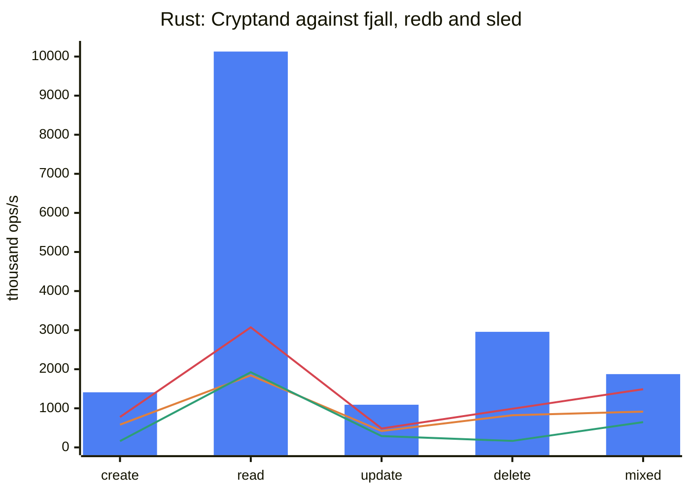
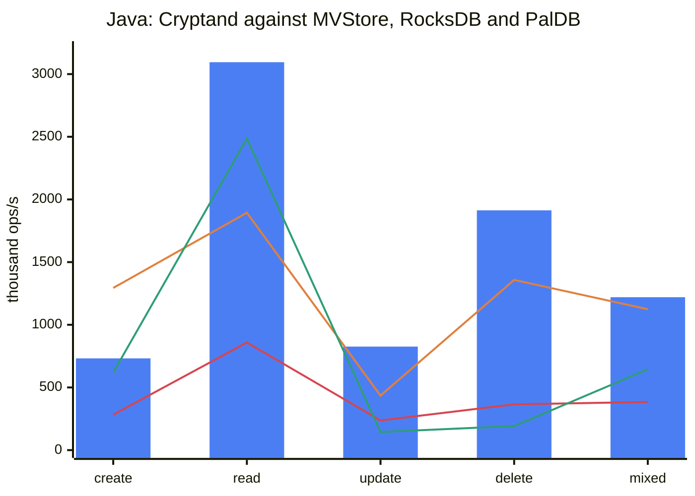
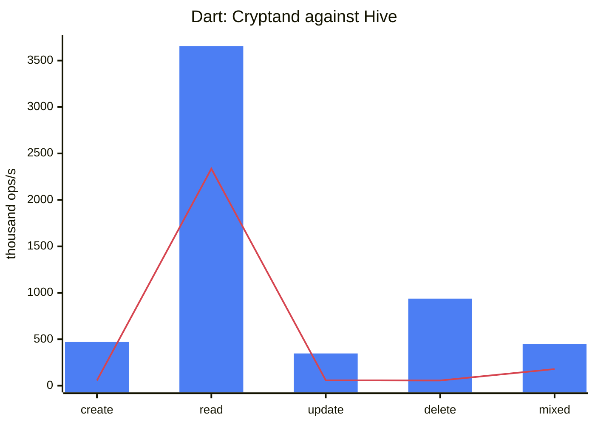
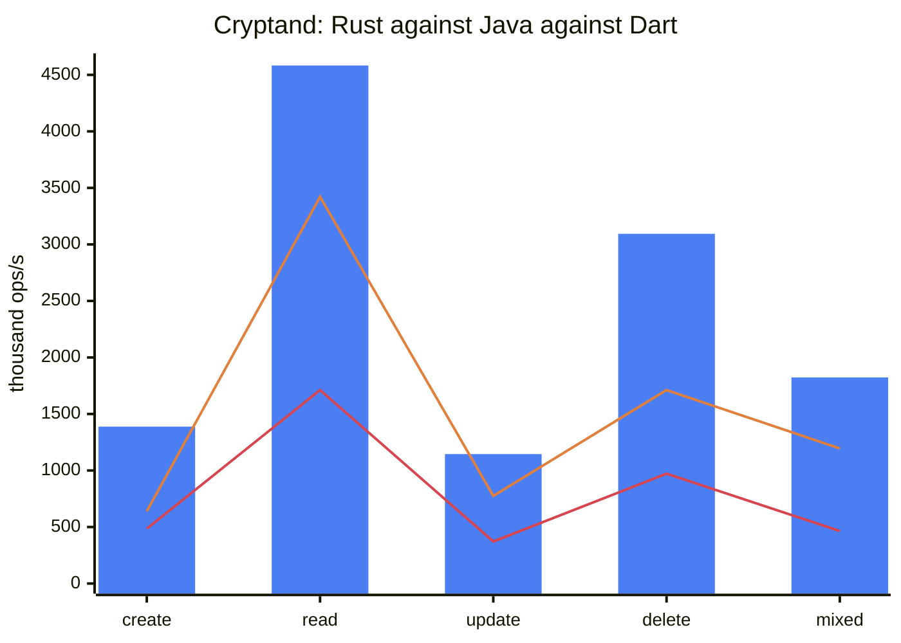

# Benchmark results

Measured 2026-09-12 on one machine: Apple Silicon, macOS/APFS, JDK 25, Dart
stable, Rust release with `lto = "fat"`. 20 000 documents, one durability
barrier per phase. Every number is the **median of 3 runs**, and every run
discards a first pass on a fresh database, because a few thousand operations on
a cold process measure the process (and on the JVM, the interpreter).

All harness code is outside the published artifacts: Java's benchmarks are
`test` scope, Dart's are outside `lib/`, Rust's are behind a non-default
`harness` feature, and each comparison suite is a separate crate, scope or
package, so no rival engine is in anybody's dependency tree but the benchmark's.

## 1. Each implementation against its field

`reference/bench/run_compare.sh`. Operations per second, higher is better.
"On disk" is the file after the run; Cryptand's is after `shrink()`, which is
untimed.

### Rust: Cryptand against fjall, redb and sled

| row | **cryptand** | fjall | redb | sled |
|---|---|---|---|---|
| create | **1 410 006** | 580 545 | 777 371 | 161 454 |
| read | **10 127 864** | 1 843 113 | 3 071 745 | 1 922 954 |
| update | **1 092 349** | 419 421 | 484 330 | 288 727 |
| delete | **2 956 904** | 824 029 | 988 647 | 166 376 |
| mixed | **1 875 000** | 914 777 | 1 489 393 | 646 188 |
| on disk (MB) | **20.9** | 67.1 | 33.7 | 51.4 |



*Bars are Cryptand; the lines are fjall, redb and sled.*

**Cryptand leads every row against all three.** The narrowest lead is mixed
against redb, 1.26×; read is 3.3× redb's. Reads call `get_ref`, a handle, in every
engine. redb is a copy-on-write B-tree with no background compaction; fjall and
sled are LSMs, closer in shape to Cryptand.

### Java: Cryptand against MVStore, RocksDB and PalDB

| row | **cryptand** | mvstore | rocksdb | paldb |
|---|---|---|---|---|
| create | 731 725 | **1 293 665** | 281 972 | 619 082 |
| read | **3 095 496** | 1 893 730 | 859 476 | 2 486 171 |
| update | **826 441** | 434 768 | 237 126 | 145 177 |
| delete | **1 912 838** | 1 357 835 | 365 345 | 191 738 |
| mixed | **1 220 238** | 1 124 206 | 383 546 | 644 790 |
| on disk (MB) | 20.9 | 33.1 | 20.3 | **10.2** |



*Bars are Cryptand; the lines are MVStore, RocksDB and PalDB.*

**Cryptand leads every row against RocksDB and PalDB, and every row but create
against MVStore.**

- **MVStore leads create because its `put` never reaches the device.** It is
  file-backed here (`MVStore.Builder().fileName(...)`), but its
  `auto_commit_delay` is 1 000 ms, so the whole file lands in the one
  `store.commit()` the create phase times.
- **PalDB is a write-once store**: an immutable file with a perfect-hash index.
  The `net.soundvibe` fork adds a write buffer compacted into a new file on
  `flush`, which is the only reason update and delete rows exist; read those as
  the fork's buffer, not as PalDB.
- **The Java read row is the noisiest number here.** Its phase is 5 000 reads,
  about 1.5 ms, and a single run can land below PalDB's.

### Dart: Cryptand against Hive

| row | **cryptand** | hive |
|---|---|---|
| create | **472 077** | 55 890 |
| read | **3 656 307** | 2 336 449 |
| update | **347 222** | 57 542 |
| delete | **937 383** | 56 382 |
| mixed | **450 238** | 178 527 |
| on disk (MB) | 21.2 | **10.2** |



*Bars are Cryptand, the line is Hive.*

**Cryptand leads every row**, by 1.57× on read and 2.5× to 16.6× on the rest.

- **Reads call `getView`**, a handle, in both, as the other two tables do.
  Cryptand's copying `get` is about 28 % slower and level with Hive.
- **A Hive `Box` keeps every value in memory**: `openBox` reads the whole file
  into a map and serves every `get` from it. `LazyBox` reads from disk but its
  `get` is asynchronous, so a row for it would measure the event loop.

## 2. The three implementations against each other

`reference/bench/run_xlang_crud.sh`: the same workload in all three, same
documents encoded before the clock starts, same keys, profile (`desktop`),
durability and pseudo-random sequence.

| row | rust | java | dart |
|---|---|---|---|
| create | **1 387 692** | 638 678 | 484 531 |
| read | **4 582 775** | 3 420 850 | 1 711 743 |
| update | **1 145 191** | 774 783 | 372 218 |
| delete | **3 093 899** | 1 711 816 | 971 628 |
| mixed | **1 822 676** | 1 195 237 | 465 344 |
| persist (ms) | 0.0 | 0.1 | 10.7 |
| shrink (ms) | 21.0 | 20.8 | - |
| file bytes | **20 840 448** | **20 840 448** | 21 102 592 |
| storage model | file-backed, segments resident | file-backed | in-memory page space |



*Bars are Rust; the lines are Java and Dart.*

**Rust leads every row, Java is second and Dart third.** Reads here call `get`,
a copy, in all three, which is why they sit below the comparison tables' rows.

**The storage model is the largest term in any gap, so read it first.** Rust and
Java write segments into the file as they go; Java also commits on a background
thread, so part of each flush lands outside the phase's clock. Dart keeps
segments in memory and places them only when it saves, which is what `persist`
costs it.

**File size.** All three hold the same live data. A full compaction writes its
output while its input is still live, so a file-backed engine ends a run with
that input's space free in front of its data; `shrink()` moves the live extents
down over it and truncates, and Rust and Java then end at the same byte count.
Dart never has that space in its file, so it has nothing to shrink, and it ends
32 pages larger.

## 3. Memory

Rust through a counting global allocator in the bench, Java as live heap after a
full GC and as the smallest `-Xmx` that completes, all three as peak RSS of one
engine per process on the comparison suite minus a process that builds the
fixtures and runs nothing.

| | |
|---|---|
| rust, heap peak inside `compact()` | 44.0 MB |
| rust, peak RSS above baseline | 70.6 MB |
| java, heap retained after `compact()` | 13.7 MB |
| java, smallest `-Xmx` that completes (fixtures alone: 40 MB) | 72 MB |
| live segments at the end of the run: rust, java, dart | 20.8, 21.6, 20.9 MB |

Against the field, peak RSS above baseline: Rust Cryptand 70.6 MB, fjall 26.9,
redb 34.2, sled 72.2. Java Cryptand needs 72 MB of heap where MVStore needs 48,
and RocksDB and PalDB fit in 40 because both keep their data off the Java heap.
Dart Cryptand peaks at about 80 MB, Hive at about 100.

## 4. Known gap

A workload where every document goes to the value log does not end at the same
file size in all three. The difference is value-log collection policy (when a
segment qualifies, and whether an emptied one is dropped), not a leak.

## Running it

```bash
reference/bench/run_compare.sh      # section 1
reference/bench/run_xlang_crud.sh   # section 2
reference/bench/run_all.sh          # the design-model suite, README.md
```

Each takes an optional document count and mixed-operation count. Read
`README.md` beside this file before comparing two columns: it says, row by row,
which are comparable across implementations and which are not.
