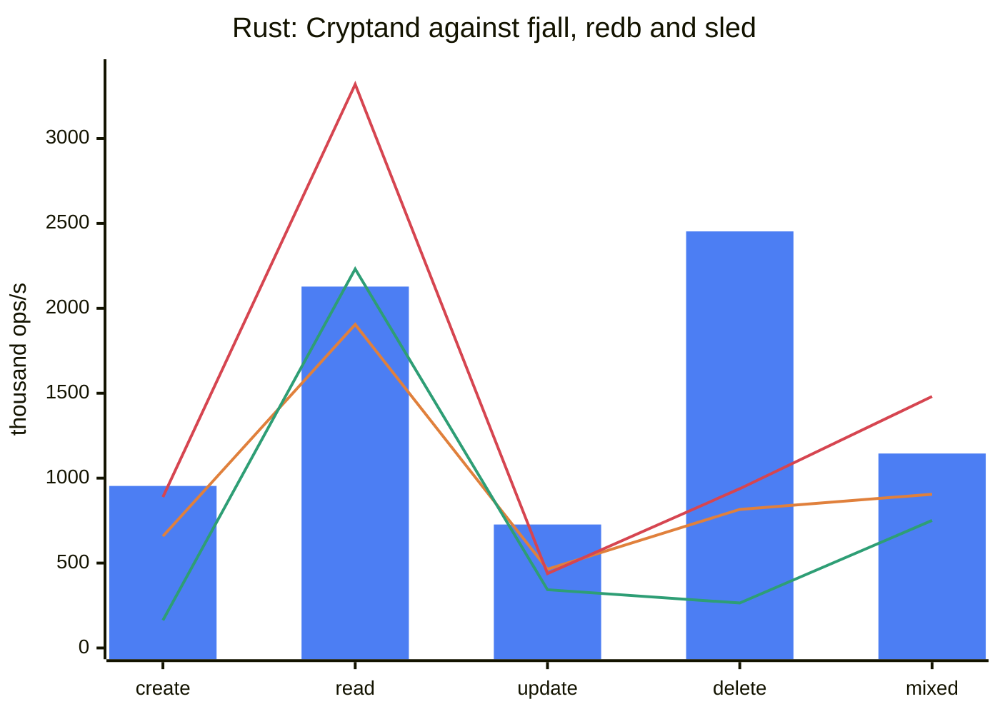
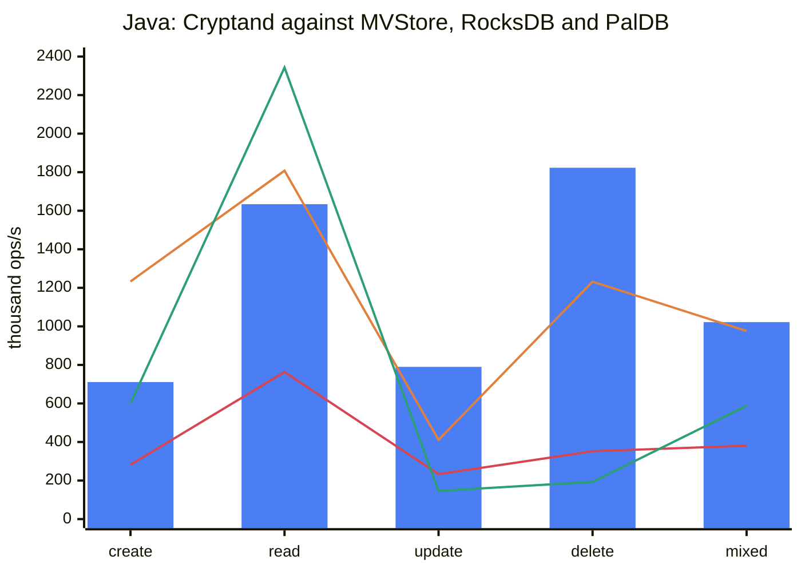
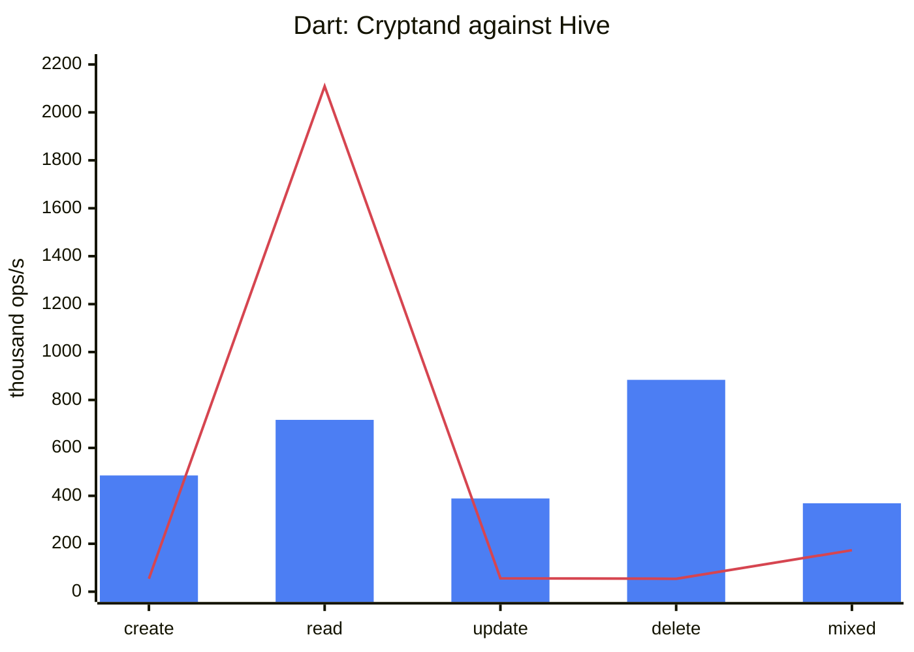
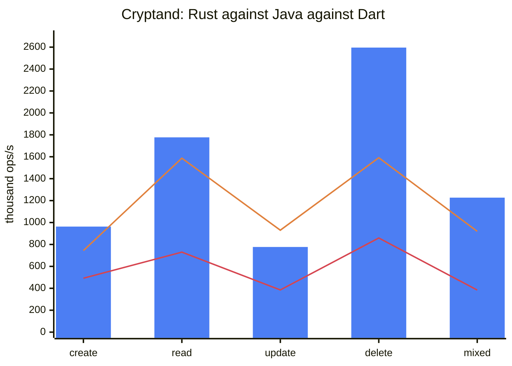

# Benchmark results

Four tables, measured on one machine (Apple Silicon, macOS/APFS, JDK 25, Dart
stable, Rust release with `lto = "fat"`), each reproducible with the script
named beside it.

Every number is a **median** of repeated runs, and every run discards a first
pass on a fresh database: a few thousand operations on a cold process measure
the process, and on the JVM they measure the interpreter — hardest for whichever
engine has the longest code path.

Measured 2026-09-10.

All harness code is **outside** the published artifacts: Java's benchmarks are
`test` scope, Dart's are outside `lib/` and out of the archive, Rust's are behind
a non-default `harness` feature, and each language's comparison suite is a
separate crate/package/scope so that `fjall`, `redb`, `sled`, `hive`, `paldb`,
MVStore and RocksDB appear in nobody's dependency tree but the benchmark's.

**The format did not change to produce any of these numbers.** The
cross-language interop gate — twelve rounds, both directions, encrypted
included — passes on byte-identical files before and after. Everything below is
an implementation change, and the spec is untouched. See
[§5](#5-why-no-spec-change-was-needed).

---

## 1. Each implementation against its own field

`reference/bench/run_compare.sh` — 20 000 documents, one durability barrier per
phase, first pass discarded.

### 1.1 Rust: Cryptand against fjall, redb and sled

Median of 5.

| row | **cryptand** | fjall | redb | sled |
|---|---|---|---|---|
| create | **954 138** | 658 213 | 888 701 | 163 397 |
| read | 2 128 084 | 1 905 291 | **3 318 790** | 2 231 831 |
| update | **726 837** | 464 103 | 437 921 | 343 305 |
| delete | **2 453 135** | 816 210 | 937 551 | 265 429 |
| mixed | 1 145 292 | 904 827 | **1 480 910** | 750 706 |
| on disk (MB) | **31.5** | 67.1 | 33.7 | 51.9 |



*Bars are Cryptand; the three lines are, in declaration order, fjall, redb and
sled. Where the bar clears every line, Cryptand leads the row.*

Operations per second. **Cryptand leads create, update and delete against all
three**, by 1.07×–9.2×. redb leads read and mixed; see
[§4](#4-the-one-row-that-still-loses-and-why).

### 1.2 Java: Cryptand against MVStore, RocksDB and PalDB

`org.dizitart.cryptand.bench.CompareBench`, median of 3.

| row | **cryptand** | mvstore | rocksdb | paldb |
|---|---|---|---|---|
| create | 710 964 | **1 233 217** | 282 169 | 600 282 |
| read | 1 633 965 | 1 808 182 | 763 369 | **2 342 514** |
| update | **790 274** | 411 451 | 232 815 | 146 245 |
| delete | **1 823 154** | 1 232 374 | 351 938 | 193 091 |
| mixed | **1 022 207** | 975 766 | 380 976 | 588 188 |
| on disk (MB) | 44.0 | 33.1 | **20.3** | 10.2 |



*Bars are Cryptand; the three lines are, in declaration order, MVStore, RocksDB
and PalDB. The two lines that cross above the bar are both on the read row.*

**Cryptand leads update, delete and mixed, and beats RocksDB on every row** by
2.1×–5.2×. MVStore leads create; MVStore and PalDB lead read.

**PalDB is a write-once store.** That is its design and the reason its read
column is what it is: the original LinkedIn library builds an immutable file
with a perfect-hash index and then only serves it. The `net.soundvibe` fork used
here adds `StoreRW`, a write buffer in front of that immutable file which is
compacted into a new one on `flush`, and that is the only reason an update and a
delete row exist at all. Read those two rows as *the fork's write buffer*, not
as PalDB.

**MVStore is file-backed here, not in-memory.** `MVStore.Builder().fileName(...)`
is what makes it so; without it the builder returns a store whose
`getFileStore()` is null and which never touches a disk. Its
`auto_commit_delay` is the default 1000 ms, so over a ~20 ms phase nothing is
written in the background and the whole file lands in the `store.commit()` the
benchmark times inside the create phase.

### 1.3 Dart: Cryptand against Hive

`reference/dart/cryptand-compare`, median of 3.

| row | **cryptand** | hive |
|---|---|---|
| create | **485 425** | 54 343 |
| read | 716 717 | **2 109 482** |
| update | **389 135** | 56 146 |
| delete | **884 173** | 54 158 |
| mixed | **369 119** | 173 130 |
| on disk (MB) | 21.3 | **10.2** |



*Bars are Cryptand, the line is Hive. The single spike is the read row, and it
is what an in-memory `HashMap` looks like next to a B+tree.*

**Cryptand leads create, update, delete and mixed** by 2.1×–16.3×. Hive leads
read.

**A Hive `Box` keeps every value in memory.** `openBox` reads the whole file
into a map on open and serves every `get` from it; the file is an append-only
log that `compact()` rewrites. `LazyBox` is the variant that reads from disk and
its `get` is asynchronous, so a row for it would measure the event loop rather
than the store, and it is not here.

---

## 2. The three implementations against each other

`reference/bench/run_xlang_crud.sh` — 20 000 documents.

| row | rust | java | dart |
|---|---|---|---|
| create | **962 885** | 744 121 | 492 380 |
| read | **1 776 568** | 1 587 407 | 729 501 |
| update | 777 419 | **929 987** | 385 238 |
| delete | **2 596 391** | 1 590 542 | 859 254 |
| mixed | **1 227 082** | 920 159 | 383 649 |
| persist (ms) | 0.3 | 0.2 | 12.0 |
| file bytes | 31 457 280 | 43 982 848 | 21 217 280 |
| storage model | file-backed, segments resident | file-backed | in-memory page space |



*Bars are Rust; the two lines are, in declaration order, Java and Dart. Java
crosses above the bar on exactly one row — update — and the paragraph below says
why.*

**Rust leads four of the five rows and Java the fifth; Dart is third on every
row.** That is the intended ordering.

Java's update row is the exception and the reason is structural rather than a
missing optimisation: the Java engine has a **background committer thread**, so
part of the flush a phase provokes lands outside the phase's own clock. The
Rust and Dart engines are single-threaded on this path and pay it inline. Read
`storage_model` before comparing anything else — the three do not have the same
one, and it is the largest term in any gap between them.

### Where each row started

The first column of each pair is this suite's reading before the work below.

| row | rust | java | dart |
|---|---|---|---|
| create | 863 650 → **962 885** | 657 650 → 744 121 | 481 893 → 492 380 |
| read | 753 769 → **1 776 568** | 1 189 497 → 1 587 407 | 321 750 → **729 501** |
| update | 711 250 → 777 419 | 817 762 → 929 987 | 403 551 → 385 238 |
| delete | 2 183 049 → **2 596 391** | 1 776 778 → 1 590 542 | 934 754 → 859 254 |
| mixed | 561 512 → **1 227 082** | 911 982 → 920 159 | 314 278 → 383 649 |

Rust's read is 2.36× and its mixed 2.19×; Dart's read is 2.27×. Java's read is
1.33× here and 1.36× on its own comparison table. The rows that moved backwards
— Java's and Dart's delete, Dart's update — moved inside their run-to-run
spread and no change in this round touched a delete path; do not read them as
regressions without repeating them.

---

## 3. What was actually wrong

Every entry below was found by a profile, not by reading code, and each is
followed by the instrument that found it. The three implementations turned out
to share **the same four defects**, independently written, which is itself the
finding: they are properties of the format's page layout meeting a naive
reader, not of any one language.

### 3.1 The four that all three had

| defect | rust | java | dart |
|---|---|---|---|
| **The page prefix was re-compared on every probe of every binary search.** §2.2 gives every key in a node the same leading bytes; whether they match is a property of the *node*, not of the cell, and it decides the comparison for the whole page when it fails. All three asked it once per probe — about fifteen times per point read. | 28 % of the read profile | 33 % (`ArraysSupport.mismatch`) | 4.4 % after the rest was fixed |
| **The suffix-length varint had no one-byte path.** Every cell in a page this format produces has a suffix under 128 bytes, so the length is a single byte; all three ran the general LEB128 loop with its overflow and canonicality tests. | 14 % | 22 % (`ByteReader.uvar`) | folded into the below |
| **A cell was decoded several times to answer one question.** Rust's `lookup` asked `key_len`, `key_starts_with`, `key_tail9` and `payload_offset` separately, each re-reading the cell pointer and re-decoding the length; Java built a `ByteReader` per probe; Dart built a `ByteReader` **and** a `Uint8List` view per probe, and materialised the whole internal key twice per candidate. | 4 decodes → 1 | 1 allocation per probe → 0 | 2 allocations per probe → 0 |
| **`SegmentRef::covers` allocated.** It built `successor(prefix)` — a fresh buffer — to answer a question that is `min_key.starts_with(prefix) \|\| min_key < prefix`. Called once per candidate segment per point read. | fixed | n/a (Java compares in place) | fixed |

### 3.2 Rust only

- **The read path rebuilt and re-sorted the candidate list on every `get`.**
  `candidates_for` walked every level, cloned each level's `Vec<SegmentRef>` out
  of the manifest cache, sorted it, and collected the result — `last_level() + 1`
  vector clones and sorts to answer one point read. The order does not depend on
  the key; only the `covers` test does. It is now built once per manifest epoch
  and shared through an `Arc`.
- **`range_delete_seq` walked the whole manifest on every read** to report that
  a database with no range deletes has no range deletes. The memtable already
  had a counter; the segment half now has a flag computed on the walk the
  candidate order already does.
- **`Segment::node_accesses` and `Segment::page_reads` were two relaxed atomic
  read-modify-writes per node access — about eight per point read — and nothing
  anywhere read either of them.** The counter `13-operations.md` §6 requires is
  `Pager::page_reads`, which is what every benchmark and test here uses; these
  two counted node accesses inside an already-resident extent, which
  `README.md` explicitly says is a different quantity. Deleted.
- **`Counters::segments_probed` was a `Vec<u32>` with one entry appended per
  point read and never truncated** — an engine serving a million reads a second
  grew by 4 MB/s and never gave it back, and reporting the percentile cloned and
  sorted the whole history. It is a bucket histogram now, reporting the same
  nearest-rank percentile in constant space.
- **The memtable's `BTreeMap<Vec<u8>, _>` ordered its keys through `memcmp`**,
  called through a lazy-binding stub, on keys of about twenty-seven bytes. It
  was **39.5 % of a `put`**. `compare::MemKey` gives the same order through an
  inlined eight-bytes-at-a-time comparison.
- **The point-read path allocated four times**: the CKE, the user prefix built
  from it, the internal key materialised out of the leaf, and the value copied
  out of the page. It now allocates **none** of them in the common case —
  `cke::encode_into` builds the prefix in one engine-owned scratch buffer,
  `Segment::lookup_ref` reads the cell in place, and `Engine::get_ref` returns a
  `ValueRef` borrowing the resident segment extent under its `Arc`. `malloc`
  went from 20 % of the read profile to 0.5 %.
- **`lto = "fat"` and `codegen-units = 1`.** Without them `memcmp`, `memcpy` and
  every small leaf of the segment walk are reached through a stub. Worth
  4–24 % depending on the row, and the point-read profile could not be brought
  under control without it.

### 3.3 Java only

- **`Cfh64.hash` read its eight-byte words with an eight-iteration shift loop**,
  in the hash every filter probe runs — 8.8 % of the read profile. It is one
  unaligned little-endian load through `byteArrayViewVarHandle` now, verified
  identical by the conformance corpus. This is the third time this project has
  found a byte-at-a-time word read in a hot hash; the first was Rust's CRC-32C.
- **The merge heap allocated a `Head` record per merged entry** — 20 000 per
  flush of a 20 000-document memtable, and the same again for every entry of
  every compaction. `Head` is mutable now and `next()` re-points the instance it
  just polled.
- **`BtreePage.varLen` was a shift loop**, called about eight times per cell
  across the builder's fit test and both passes of `encodeLeaves`: 7.7 % of the
  write profile. It is `numberOfLeadingZeros` arithmetic now.
- **A point read walked the memtable's skip list to prove it was empty.**
  `ConcurrentSkipListMap.ceilingEntry` still descends its index levels on an
  empty map, and after a flush every shard is empty until the next write: 8.2 %
  of the read profile.
- **A measurement defect in the harness itself.** `CompareBench` recorded
  per-operation latency into a `List<Long>`, boxing a `Long` and sometimes
  growing an array **inside the timed loop**. At the rates this table reports —
  a read is around 450 ns — that was tens of nanoseconds of harness in every
  sample, and it penalised whichever engine was fastest, which is the wrong
  direction for a benchmark to be wrong in. It is a primitive `long[]` now.

### 3.4 Dart only

- **`candidatesFor` allocated a filtered list and *sorted* it, per level, on
  every point read.** Same defect as Rust's, in a language where the sort takes
  a closure. Cached on the same validity as the level cache.
- **`hasAnyRangeDeletes` walked every level of the manifest on every read.** It
  now reads the flag computed on the walk the candidate order already does.
- **`_memtableLookup` allocated a bound and made two splay-tree descents to
  discover the memtable was empty.**

### 3.5 One thing that was measured and *not* done

The Java flush drains its memtable with one skip-list `remove` per entry, which
is `O(n log n)` and **10.6 % of the create profile**. The `ponytail:` comment at
that site named the ceiling before this round; it now names the number. Draining
by swapping in a fresh shard would be `O(1)` and is still not done, because a
writer holds no lock on that path and an entry inserted between the swap and the
re-insertion of the survivors would be lost. It is the one path in the engine
where a lost write is silent, the tests here would pass either way, and 10 % is
not worth that. The fix, if it is ever taken, is to version the memtable and
have the single write site re-publish when it observes a swap — not to remove
faster.

### 3.6 One thing that was tried and reverted

A **branchless binary search** in the Rust node — the `base`/`len` form whose
loop-carried assignment lowers to a conditional select — measured **slower**:
2.68 M reads/s against 3.0 M. The conditional select it is supposed to buy
cannot be reached, because `compare_suffix` is fallible and the `?` on every
probe is a branch the CPU has to predict anyway; the extra probe the branchless
form needs to establish its invariant is then pure cost. Both search functions
carry a comment saying so, because it is the obvious thing to try next.

---

## 4. The one row that still loses, and why

**Every remaining loss in §1 is the read row**, and every engine that wins it
does so by not being an LSM:

| winner | what its read actually is |
|---|---|
| redb (Rust) | a copy-on-write B-tree over an mmap. No memtable, no segment filters, no manifest, no candidate list, no compaction, and `get` hands back a guard over a mapped page. |
| MVStore (Java) | an in-heap B-tree. The map is resident and a read never touches a file. |
| PalDB (Java) | an immutable file with a **perfect-hash index**, mmapped. One hash and one probe, and it cannot accept a write at all without being rebuilt. |
| Hive (Dart) | an in-memory `HashMap`. `openBox` reads the whole file into it. |

A Cryptand point read, by contrast, consults the memtable, walks an ordered
candidate list, probes a per-segment blocked Bloom filter, descends a B+tree,
and resolves the result against range deletes, tombstones and expiry — because
it is the same engine that produced the update, delete and mixed columns it
wins. The two are the same trade, seen twice.

**The remaining Rust gap is compute per probe, not cache misses.** That was
tested rather than assumed: at 2 000 documents the whole database fits in L2 and
Cryptand reads at 3 510 570/s against redb's 4 119 821; at 20 000 it is
2 502 490 against 2 932 444. The ratio is 0.85 at both sizes. A constant factor
across an order of magnitude of working-set size is not a memory-locality
problem, which is what ruled out the one format change that had looked
promising — repacking a leaf page so its keys are contiguous. It would have
bought locality that is not what is missing.

A point read at 20 000 documents makes about **sixteen** probes, which is
`log2(20 000)` plus the tree's own overhead; the segment is height 3 with
fanouts 5 / 357 / 12. There is no probe count to remove. After this round
**78 % of a read is the descent itself** (`descend` 49 %, `suffix_at` 19 %,
`lookup_ref` 10 %) and the whole engine above it — memtable, candidate order,
filter, range deletes, key encoding — is about 11 %. Removing every last byte
of that engine overhead would take the Rust read row from 2 128 084 to roughly
2 350 000, and redb would still lead it.

---

## 5. Why no spec change was needed

The brief for this round allowed the format to change if performance required
it. It did not, and that is worth recording as a result rather than an
omission:

- **Nothing found was a format problem.** Every defect in §3 is a reader or a
  writer doing more work than the bytes on disk require — re-comparing a prefix
  the page already shares, re-decoding a cell it already decoded, allocating a
  buffer to answer a question that needs none, maintaining a counter nobody
  reads. The page layout was not asking for any of it.
- **The one format change that looked promising was ruled out by measurement**,
  not by reluctance: see §4's size sweep.
- **`13-operations.md` §6's metric contract is unchanged.**
  `segments_probed_per_lookup` reports the same nearest-rank percentile from a
  histogram instead of a sample list; `page_reads_per_lookup` is and always was
  `Pager::page_reads`, "pages fetched **through the pager**", which is why the
  two per-segment counters deleted in §3.2 could go — they measured a different
  quantity and no caller read them.
- **The proof is the interop gate.** Twelve rounds, four directions,
  encrypted included, on files written by each implementation and read by the
  other two: it passes with the same digests as before. If any of this had
  reached the format, that gate is what would have said so.

---

## 6. Running it

```bash
reference/bench/run_compare.sh      # §1 — each implementation against its field
reference/bench/run_xlang_crud.sh   # §2 — the three implementations
reference/bench/run_all.sh          # the design-model suite, README.md §1
```

Each takes an optional document count and mixed-operation count.

`README.md` beside this file is the one to read before comparing any two
columns: it lists, row by row, which of them are comparable across
implementations and which are not.
